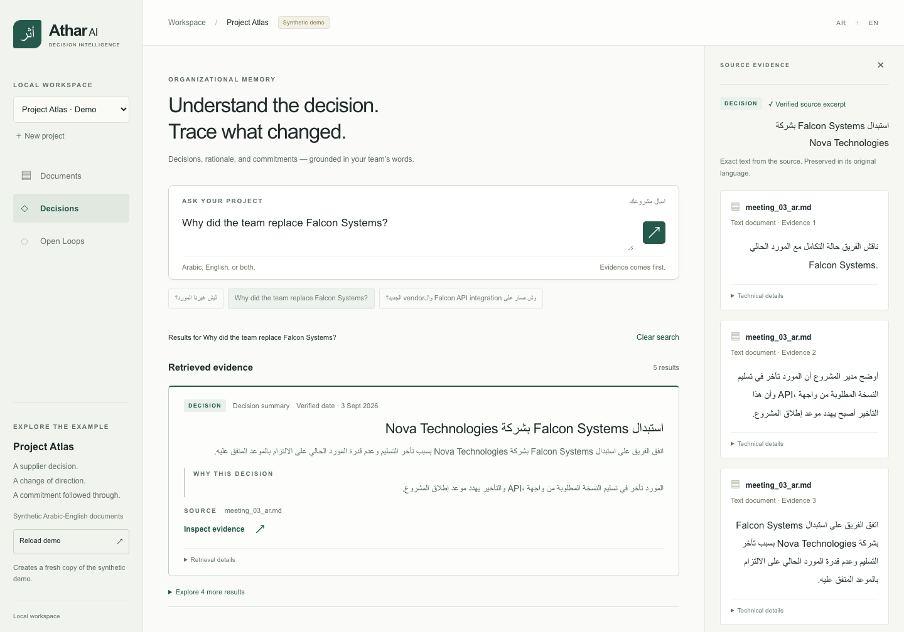
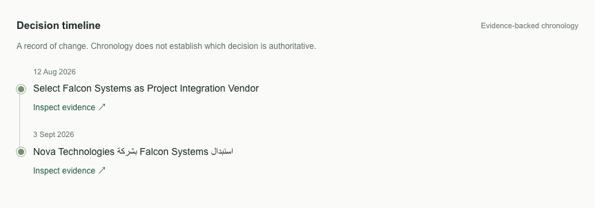
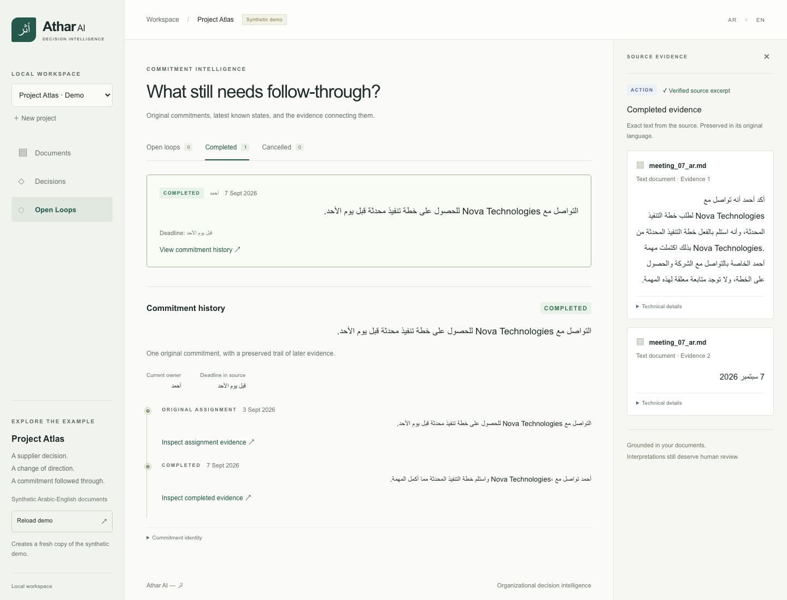
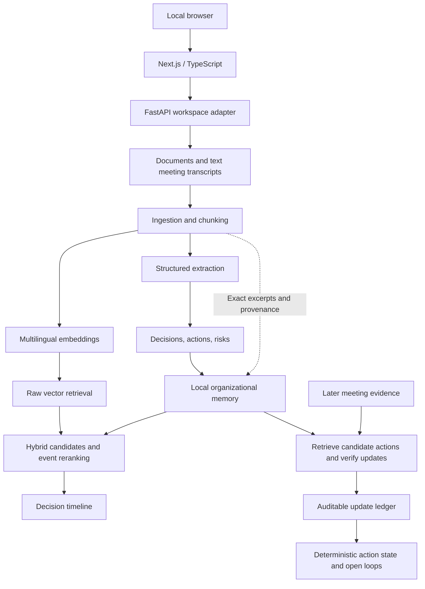

# Athar AI — أثر

### Organizational memory that can explain itself.

**Bilingual decision intelligence for Arabic-English teams.**

> Projects rarely lose information.
> They lose the **why** behind it.

Athar turns scattered project documents and meeting notes into an evidence-backed record of:

**decisions · rationale · changes · commitments · risks**

Ask:

**ليش غيرنا المورد؟**

*Why did we replace the supplier?*

**Ask what happened. Know why. See the evidence.**

[](https://github.com/kkhbrany7166/athar-ai/actions/workflows/ci.yml)



Not chat-with-PDF. Athar models decisions, commitments, and the evidence that changes them over time.

**Current scope:** Athar returns structured decisions, actions, risks, and exact source excerpts. Decision timelines preserve chronology; action histories connect later evidence to the original commitment. Generated conversational answers remain planned.

## Why not just RAG?

A conventional retrieval system asks:
“Which chunks are most similar to this query?”

Athar has to resolve something harder:
“Which organizational event is the user referring to, what changed later, and what evidence supports that history?”

Typed organizational memory makes `Decision`, `ActionItem`, and `Risk` records explicit candidates for hybrid retrieval and event-aware reranking. Decision chronology places supplied decisions in time. Evidence-backed action history connects later updates to original commitments and supports derived open-loop state. Exact source evidence remains attached to each structured record.

These mechanisms extend retrieval for organizational history; they do not discover every relationship or resolve contradictions.

**Retrieval finds evidence. Organizational memory gives that evidence a history.**

## What Athar remembers

| Team question | Athar surfaces |
| --- | --- |
| What did we decide? | Decision + verified date, when available |
| Why? | Rationale + exact evidence |
| What changed later? | Decision chronology |
| Who promised what? | Action + owner |
| Did they follow through? | Evidence-backed lifecycle |
| What is still unresolved? | Open loops |
| What could derail us? | Risks |
| Where did this come from? | Source + page where available + verified excerpt |

## The failure that shaped Athar

**“Why did the team replace Falcon Systems?”**

The first retrieval prototype failed in an interesting way. Dense retrieval preferred the older document explaining why Falcon was originally **selected**, ahead of the later Arabic meeting explaining its **replacement**. Both events shared Falcon, API, vendor, and project vocabulary. Related text was not enough to answer the organizational question.

**Dense retrieval understood the topic. It did not understand the event.**

That failure motivated separate structured organizational records and hybrid raw + structured retrieval. A bounded event-aware reranker evaluates which candidates address the requested event. Baseline ranks and scores remain available alongside reranked ranks and relevance judgments.

In the Project Atlas acceptance run, the replacement decision moved from baseline rank 2 to rank 1. **Project Atlas is a synthetic acceptance story, not a general retrieval benchmark.** This result explains the design; it does not establish broad superiority or guarantee the same ranking on every live run.

## Project Atlas — one decision, one reversal, one commitment

The three [synthetic Atlas documents](examples/project_atlas/README.md) tell a small, auditable story:

### 12 Aug 2026 — Falcon selected

The steering committee selects Falcon Systems for its enterprise integration experience and commitment to complete API integration before the October launch milestone.

### 3 Sep 2026 — The decision changes

API delivery delays threaten launch. The team replaces Falcon with Nova Technologies and assigns Ahmed (أحمد) to contact Nova for an updated implementation plan before Sunday.



### 7 Sep 2026 — The commitment closes

Later meeting evidence confirms that Ahmed contacted Nova and received the updated plan, completing the follow-up.

Athar preserves the same underlying `ActionItem` identity across assignment and completion. The completion is a separate evidence-backed event; it does not rewrite the original assignment or its citations. The latest known state is derived from that history.



The demo runs the actual pipeline, not precomputed result cards. Its dates and outcomes belong to the synthetic source story. Unknown dates remain unknown, and chronological order does not establish which decision is authoritative.

## Evidence before eloquence

A proposed fact needs a traceable source before it enters organizational memory.

- **The model proposes structured facts.** Application code assigns provenance, document/chunk identities, and content-derived record IDs.
- **Excerpts must match source content exactly.** Invalid grounding rejects the proposed record; rejection diagnostics remain available. Saved memory is validated again when loaded.
- **Assignments remain intact.** Later action events reference the original action ID and carry their own verified evidence. Code validates matches, owners, and dates before deriving lifecycle state.
- **Uncertainty stays visible.** Unsupported dates remain unknown; undated or ambiguous lifecycle events are retained for review rather than silently treated as reliable progress.

> **If Athar cannot show where a record came from, it should not pretend that record is grounded.**

Exact matching verifies that a quote occurs in the source. It does **not** prove that the model's interpretation follows from it. Rationale, risk classification, and action matching still need human review. Content-derived IDs are reproducible for identical inputs and extracted content; changed model wording can produce different IDs on re-extraction.

## Design principles

### 1. Evidence is part of the record

A structured record is incomplete without traceable source evidence. Grounding checks apply both when records are created and when saved memory is loaded.

### 2. Unknown stays unknown

Unsupported dates remain unknown. Unknown action states remain unresolved; ambiguous same-day outcomes are retained for review rather than assigned an invented order.

### 3. History is appended, not rewritten

Later evidence adds lifecycle events that reference the original assignment. It can change the latest known state without overwriting the original action or its evidence.

### 4. Models propose; application code decides what is trusted

Models perform semantic extraction, relevance judgments, and action matching. Application code validates IDs, evidence, provenance, and explicit owners/dates where applicable, then derives lifecycle state. Those checks enforce record integrity, not semantic correctness.

## Architecture

```text
Documents
↓
Evidence
↓
Organizational memory
↓
Event-aware retrieval
↓
Decision history + open loops
```

The architecture separates what the source says, what the model proposes, and what application code accepts. This is the conceptual flow; action lifecycle processing has its own evidence-matching path, shown below.



Extraction operates on source chunks, independently of retrieval. Later updates are separate events: they do not overwrite original commitments. The model proposes a match and event type; application code validates IDs, excerpts, owners, and dates, then derives state.

## How Athar works

1. **Ingest and index.** Parse TXT, Markdown, and text-based PDFs; preserve source/page metadata and chunk offsets; embed Arabic, English, and mixed text through the same path. Raw retrieval uses local NumPy cosine search.
2. **Build organizational memory.** Extract typed decisions, actions, and risks independently of retrieval. Verify literal evidence, assign provenance and IDs in code, then persist a validated JSON snapshot.
3. **Retrieve the event.** Search cached memory embeddings and raw chunks together. Rerank a bounded candidate pool with one structured model call; preserve original objects and baseline ranks. Invalid or failed reranking falls back to the baseline.
4. **Expose chronology and follow-through.** Order supplied decisions by source-verified dates. Match later evidence against candidate commitments, append validated updates, and derive latest known state and open loops in code. Unknown states remain unresolved.

**Athar stays deliberately close to the primitives.** This keeps ranking, grounding, provenance, lifecycle state, and failure fallbacks inspectable. It uses the official OpenAI SDK without LangChain, LlamaIndex, or a hosted vector database.

| Layer | Technology |
| --- | --- |
| Engine and validation | Python, OpenAI structured outputs, Pydantic |
| Retrieval and document parsing | NumPy, pypdf |
| Local API | FastAPI |
| Browser application | Next.js, TypeScript, React |
| Verification | Python unittest, frontend unit tests, Playwright, GitHub Actions |

## Local web application

The local workspace has Documents, Decisions/search, and Open Loops views, with a dedicated evidence panel on desktop and evidence below the main view on smaller screens. Search distinguishes decisions, actions, risks, and documents; advanced ranking details stay optional.

Interface labels are English. Arabic, English, and mixed-language records use automatic text direction, and evidence renders as literal text. Uploads move through **Uploaded → Processing → Ready**, with safe errors and retry feedback. Completed commitments are available separately from unresolved work.

The browser calls FastAPI, which delegates to the existing `athar/` modules. The Python engine remains the source of truth. See [API contracts and workspace persistence](docs/web-app.md) for endpoints, atomic snapshots, and UI boundaries; its verification notes record an earlier application acceptance run.

## Quick start and demo

### Python setup

Live operations require **Python 3.11+**, network access, and an OpenAI API key with access to the configured models and available quota. Offline tests require no API key. Run from the repository root:

```bash
python3 -m venv .venv
source .venv/bin/activate
pip install -r requirements.txt
cp .env.example .env
```

Edit `.env` locally and replace the placeholder with your `OPENAI_API_KEY`. Do not share or commit it. Athar loads the project's `.env` through an explicit `pathlib` path; existing environment variables take precedence. No manual shell export is required.

### Start the web application

Use **Node.js 20.9+** and the Python setup above. In terminal 1, from the repository root:

```bash
source .venv/bin/activate
pip install -r requirements.txt
uvicorn server.main:app --reload --host 127.0.0.1 --port 8000
```

In terminal 2, from the repository root:

```bash
cd web
npm ci
cp .env.example .env.local
npm run dev
```

Open **http://localhost:3000**. `web/.env.local` contains only `NEXT_PUBLIC_ATHAR_API_URL=http://localhost:8000`. **Never put OpenAI credentials in the Next.js environment.** `OPENAI_API_KEY` belongs in the repository-root Python `.env`; the server loads it explicitly. Existing shell variables take precedence.

### Atlas UI walkthrough

1. Click **Load Project Atlas**. A fresh, clearly labeled synthetic workspace copies the three versioned example files into ignored runtime storage.
2. Watch **Processing** advance through extraction, lifecycle matching, and indexing. The initial two documents establish memory; the September 7 follow-up updates the original action through the existing matcher. All three become **Ready**.
3. Explore **Decisions**, or ask “ليش غيرنا المورد؟” / “Why did the team replace Falcon Systems?” Inspect rationale and the right-hand **Source evidence** panel. Its excerpts are literal backend text, never frontend summaries.
4. Inspect the August 12 / September 3 timeline. Unknown or unverified dates remain **Unknown date**; order does not assert authority.
5. Open **Open Loops → Completed** and select Ahmed’s commitment. Its assignment and completion evidence retain one original action identity. The latest known state is separate from the original extracted status.

Model output can vary. Records whose grounding checks fail are omitted and counted in the UI. Loading a new demo runs new live, billable processing; it never injects expected records or uses precomputed answers.

For your own documents, create a **New project**, choose `.txt`, `.md`, or text-based `.pdf` files, then **Process documents**. Each file is limited to 10 MB and each project to 30 files. Add later evidence in a subsequent processing batch to match updates against existing commitments. New standalone records are also extracted. A failed job retains uploads and the previous successful snapshot for retry.

### Run the CLI Atlas demo

```bash
python -m scripts.demo_atlas
```

The live demo uses only the three story documents in [examples/project_atlas](examples/project_atlas/README.md). It:

1. Parses all three documents and indexes the first two, holding back the later meeting.
2. Extracts decisions, actions, and risks with verified evidence.
3. Retrieves and reranks the replacement decision for “Why did the team replace Falcon Systems?”, displaying its rationale and citations.
4. Shows the initial-selection → replacement decision timeline.
5. Lists the unresolved commitment, processes the later meeting, and shows the same action ID becoming completed.

All counts, records, scores, and state transitions come from actual pipeline outputs. The example-specific checks verify expectations; they do not inject answers. The script returns **0** when checks pass, **1** on a setup/API/pipeline failure, and **2** when a run completes but its expected results are not met.

Each run creates a fresh ignored `data/processed/atlas-demo-*` directory containing its indexes, memory, search results, action history, and `demo_report.json`. It does not depend on existing local documents or generated stores. Partial artifacts are retained on failure. These directories can be deleted when no longer needed.

The demo makes **live, billable API requests** and can take several minutes. Defaults are `text-embedding-3-small` for embeddings and `gpt-4.1-mini-2025-04-14` for extraction, reranking, and update matching; see [configuration](athar/config.py). Model output can vary, so reproducible inputs and execution do not imply identical outputs on every run.

## Testing and CI

[GitHub Actions CI](.github/workflows/ci.yml) runs on pushes to `main` and `feature/athar-ui`, and pull requests targeting `main`. Its two Ubuntu jobs check:

| Job | Checks |
| --- | --- |
| Python 3.11 backend | Dependency installation, **113 offline tests** (91 engine/CLI + 22 API), and compilation |
| Node 24 frontend | Lockfile installation, TypeScript checks, **4 unit tests**, **9 mocked Playwright browser tests**, and Next.js production build |

CI requires **no OpenAI secrets and makes no live API calls**. Playwright starts Next.js and mocks API responses; it does not require the Python server. These tests establish software behavior, not semantic accuracy.

Run the equivalent checks locally after installing dependencies:

```bash
python -m unittest discover -v
python -m compileall -q athar server scripts tests
python -m scripts.demo_atlas --help
cd web
npm ci
npm run typecheck
npm test
npx playwright install chromium
npm run test:ui
npm run build
```

The Linux CI job uses `npx playwright install --with-deps chromium` to install browser system dependencies as well.

The opt-in browser smoke test requires both servers and real OpenAI access. It makes **live, billable API requests** and is excluded from ordinary tests and CI:

```bash
cd web
npx playwright install chromium
ATHAR_LIVE_DEMO=1 node scripts/verify-atlas.mjs
```

It checks real Atlas processing, search/evidence equality, timeline dates, same-ID completion, and responsive layout, saving screenshots and a report under ignored `data/processed/web-verification/`. Model output can vary; the test does not bypass grounding to force a passing result.

## Project structure

```text
athar-ai/
├── .github/workflows/ci.yml # Offline backend and frontend CI
├── athar/                   # Ingestion, extraction, retrieval, evidence, lifecycle logic
├── server/                  # FastAPI schemas, local workspaces, engine orchestration
├── web/                     # Next.js / TypeScript UI and frontend tests
├── scripts/                 # Demo and focused command-line tools
│   └── demo_atlas.py
├── examples/
│   └── project_atlas/       # Three synthetic story documents and walkthrough
├── evals/                   # Labeled retrieval questions and acceptance fixtures
├── tests/                   # Offline unit and integration tests
├── docs/
│   ├── engineering.md      # Detailed contracts, validation history, and limitations
│   └── web-app.md          # API, persistence, and UI boundaries
├── .env.example
├── .gitignore
├── requirements.txt
└── README.md
```

For individual ingest, extraction, search, timeline, and open-loop commands, see the [engineering notes](docs/engineering.md).

## Engineering details and evaluation

The implemented surface includes:

- TXT / Markdown / text-based PDF ingestion, with source identity and page metadata.
- Arabic-English semantic retrieval and local NumPy cosine vector search.
- Grounded Decision / ActionItem / Risk extraction using Pydantic structured outputs.
- Exact evidence-excerpt verification and persistent organizational memory.
- Cached memory embeddings and hybrid raw + structured candidate retrieval.
- Event-aware reranking with baseline ranks/scores retained and failure fallback.
- Decision timelines using verified dates; unknown dates remain unknown.
- Evidence-backed action lifecycle tracking and open-loop detection.
- Read-only owner/state filters and auditable action histories.
- Offline test suite and a synthetic, end-to-end Project Atlas demo.
- Local Next.js / TypeScript application and FastAPI adapter: documents, bilingual search, decision timelines, exact evidence, and open-loop/action-history views.

The [engineering notes](docs/engineering.md) preserve detailed contracts and historical validation results: content-versioned IDs, chunk offsets, atomic vector/JSON persistence, cache invalidation, first-stage ranking parameters, reranking validation and fallback, lifecycle transitions, idempotency, and focused CLI commands. Their earlier planned-work lists are historical; current implemented and planned scope is listed here.

Tests cover provenance, persistence, ranking, invalid model IDs and evidence, API failure handling, timelines, lifecycle transitions, and idempotency. API tests cover isolated workspaces, upload validation, safe errors, incremental processing, search, and same-ID action history.

[Evaluation datasets](evals/README.md) include Arabic, English, and mixed-language questions about decisions, reasons, actions, risks, history, and event transitions. The 20 focused organizational queries define labels for future Recall@K and top-1 comparisons. They are variations on a small synthetic story, not independent organizational scenarios. An automated metric runner and a larger independently labeled corpus remain future work; no aggregate accuracy percentage is claimed.

## Boundaries and data handling

- Exact excerpt matching proves that text occurs in a source; it does not prove that every model interpretation follows from that text. Human review remains necessary.
- Reranking only sees a bounded candidate set and cannot recover evidence excluded by first-stage retrieval. Intent attributes and relevance judgments can be wrong.
- Action matching accepts at most one update per chunk. Unknown dates and ambiguous same-day events require review; relative deadlines are not converted into overdue judgments. Unknown actions count as unresolved.
- Reprocessing identical update chunks skips model calls and duplicate events. Edited source versions create new history. Cross-chunk semantic deduplication and identity reconciliation remain limited.
- PDF OCR, audio transcription, access control, and production concurrency guarantees are absent. This is not a production-grade project management system.
- Document text, queries, and selected evidence are sent to OpenAI during live operations. Local JSON and vectors are not encrypted.
- `.env`, virtual environments, bytecode, generated vectors, memory, and runtime/acceptance files are ignored by Git. Only synthetic examples are intended for version control.
- Python dependency ranges are specified rather than a lockfile; the frontend has a package-lock.json. CI runs the backend on Python 3.11; earlier local checks also used Python 3.14.

### Local security boundary

- Bind both servers to loopback. This is a single-user, single-Python-worker local application with no authentication; do not expose it to a network.
- CORS accepts only `http://localhost:3000` and `http://127.0.0.1:3000`; foreign Origin writes and unexpected Host headers are rejected.
- The API accepts project/file identities, never filesystem paths. Upload filenames are validated and stored under generated UUIDs in ignored `data/processed/web/`, never under `examples/`.
- Request and file sizes are bounded. UTF-8 text and PDF signatures are checked; parsing rejects unsupported PDFs and missing extractable text. OCR is not included.
- API errors omit provider bodies, rejected input, stack traces, and credentials. The API does not serve raw upload files, `.env`, or runtime directories.
- Document text and queries are sent to OpenAI during live processing/search. Local files are not encrypted. There is no automatic retention/deletion UI, job cancellation, or distributed worker coordination.

## Planned work

- Contradiction detection.
- Grounded natural-language answer synthesis.
- Agent/tool orchestration.

No Slack/email integration, autonomous action execution, or general conversational agent is implemented.
