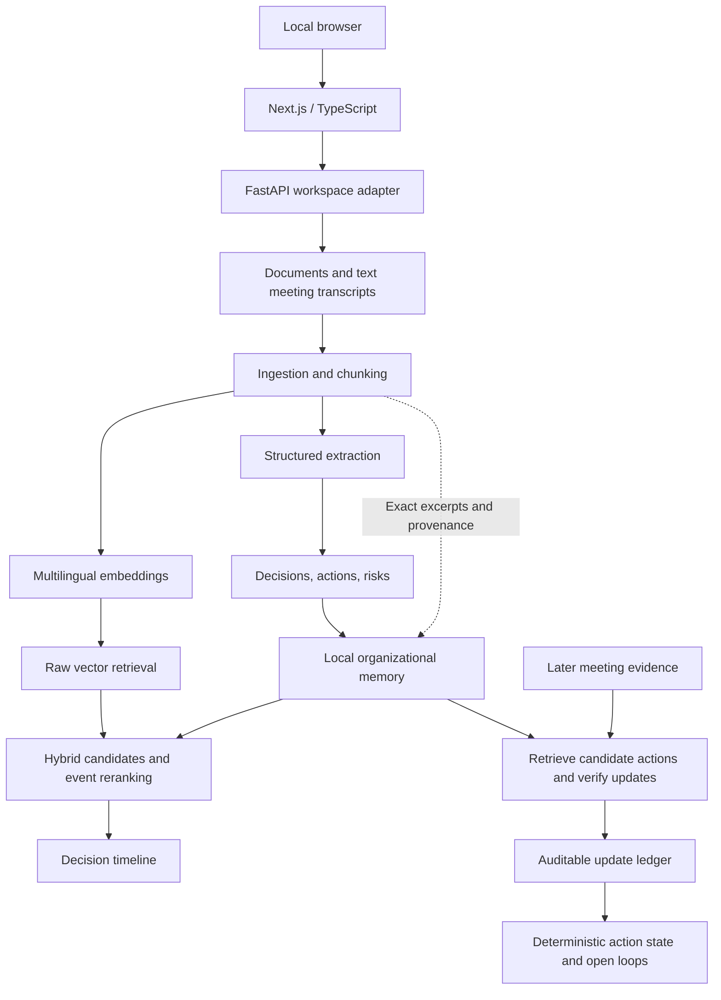

# Athar AI — أثر

**Bilingual organizational decision intelligence for Arabic-English teams.**

Athar turns fragmented project documents and text meeting transcripts into an evidence-grounded memory of decisions, rationale, risks, commitments, owners, decision history, and action lifecycle. It models organizational events and tracks how later evidence changes their known state.

Ask **“ليش غيرنا المورد؟”** — “Why did we change the supplier?” — and Athar can retrieve the replacement decision, its rationale, the supporting meeting evidence, and the earlier selection history. It currently returns structured records and citations, not a generated natural-language answer.

Commitments have history too. In the synthetic Project Atlas example:

| Date | Evidence-backed event |
| --- | --- |
| September 3, 2026 | أحمد is assigned to contact Nova Technologies and obtain an updated implementation plan. |
| September 7, 2026 | Contact was made and the updated plan was received. |
| Latest known state | **Completed**, with the original ActionItem ID and assignment evidence preserved. |

Athar is an inspectable AI engineering project built with the official OpenAI SDK, Pydantic, NumPy, and pypdf. It uses no LangChain, LlamaIndex, or hosted vector database.

## Run the Atlas demo

Requires **Python 3.11+**, network access, and an OpenAI API key with access to the configured models and available quota. Run from the repository root:

```bash
python3 -m venv .venv
source .venv/bin/activate
pip install -r requirements.txt
cp .env.example .env
```

Edit `.env` locally and replace the placeholder with your `OPENAI_API_KEY`. Do not share or commit it. Athar loads the project's `.env` through an explicit `pathlib` path; existing environment variables take precedence. No manual shell export is required.

```bash
python -m scripts.demo_atlas
```

The live demo uses only the three story documents in [examples/project_atlas](examples/project_atlas/README.md). It:

1. Parses all three documents and indexes the first two, holding back the later meeting.
2. Extracts decisions, actions, and risks with verified evidence.
3. Retrieves and reranks the replacement decision for “Why did the team replace Falcon Systems?”, displaying its rationale and citations.
4. Shows the initial-selection → replacement decision timeline.
5. Lists the unresolved commitment, processes the later meeting, and shows the same action ID becoming completed.

All counts, records, scores, and state transitions come from actual pipeline outputs. The example-specific checks verify expectations; they do not inject answers. The script returns **0** when checks pass, **1** on a setup/API/pipeline failure, and **2** when a run completes but its expected results are not met.

Each run creates a fresh ignored `data/processed/atlas-demo-*` directory containing its indexes, memory, search results, action history, and `demo_report.json`. It does not depend on existing local documents or generated stores. Partial artifacts are retained on failure. These directories can be deleted when no longer needed.

The demo makes **live, billable API requests** and can take several minutes. Defaults are `text-embedding-3-small` for embeddings and `gpt-4.1-mini-2025-04-14` for extraction, reranking, and update matching; see [configuration](athar/config.py). Model output can vary, so reproducible inputs and execution do not imply identical outputs on every run.

## Run the local web application (Phase 5)

The browser calls a small FastAPI adapter, which calls the existing `athar/` engine. AI logic remains in Python; the frontend renders returned records and exact verified excerpts. The CLI above remains available unchanged.

Use **Node.js 20.9+** (verification used Node 24) and the Python setup above. In terminal 1, from the repository root:

```bash
source .venv/bin/activate
pip install -r requirements.txt
uvicorn server.main:app --reload --host 127.0.0.1 --port 8000
```

In terminal 2, from the repository root:

```bash
cd web
npm install
cp .env.example .env.local
npm run dev
```

Open **http://localhost:3000**. `web/.env.local` contains only `NEXT_PUBLIC_ATHAR_API_URL=http://localhost:8000`. **Never put OpenAI credentials in the Next.js environment.** `OPENAI_API_KEY` belongs in the repository-root Python `.env`; the server loads it explicitly. Existing shell variables take precedence.

If multiple Node installations are present, verify the Node version used inside npm scripts. On the verification machine, prepending `/usr/local/bin` to `PATH` selected the installed Node 24 instead of an older Homebrew Node 18:

```bash
export PATH="/usr/local/bin:$PATH"
```

### Atlas UI walkthrough

1. Click **Load Project Atlas**. A fresh, clearly labeled synthetic workspace copies the three versioned example files into ignored runtime storage.
2. Watch **Processing** advance through extraction, lifecycle matching, and indexing. The initial two documents establish memory; the September 7 follow-up updates the original action through the existing matcher. All three become **Ready**.
3. Explore **Decisions**, or ask “ليش غيرنا المورد؟” / “Why did the team replace Falcon Systems?”. Inspect rationale and the right-hand **Source evidence** panel. Its excerpts are literal backend text, never frontend summaries.
4. Inspect the August 12 / September 3 timeline. Unknown or unverified dates remain **Unknown date**; order does not assert authority.
5. Open **Open Loops → Completed** and select Ahmed’s commitment. Its assignment and completion evidence retain one original action identity. The latest known state is separate from the original extracted status.

Model output can vary. Records whose grounding checks fail are omitted and counted in the UI. Loading a new demo runs new live, billable processing; it never injects expected records or uses precomputed answers.

For your own documents, create a **New project**, choose `.txt`, `.md`, or text-based `.pdf` files, then **Process documents**. Each file is limited to 10 MB and each project to 30 files. Add later evidence in a subsequent processing batch to match updates against existing commitments. New standalone records are also extracted. A failed job retains uploads and the previous successful snapshot for retry.

### Local application checks

```bash
python -m unittest discover -v
python -m compileall -q athar scripts server tests
cd web
npm run typecheck
npm test
npm run build
npx playwright install chromium
npm run test:ui
```

The `test:ui` browser tests mock all API responses and make no billable calls.

The opt-in browser smoke test requires both servers and real OpenAI access; it is deliberately excluded from ordinary tests:

```bash
cd web
npx playwright install chromium
ATHAR_LIVE_DEMO=1 node scripts/verify-atlas.mjs
```

It checks real Atlas processing, search/evidence equality, timeline dates, same-ID completion, and responsive layout, saving screenshots and a report under ignored `data/processed/web-verification/`. See [web API and persistence notes](docs/web-app.md).

### Local security boundary

- Bind both servers to loopback. This is a single-user, single-Python-worker local application with no authentication; do not expose it to a network.
- CORS accepts only `http://localhost:3000` and `http://127.0.0.1:3000`; foreign Origin writes and unexpected Host headers are rejected.
- The API accepts project/file identities, never filesystem paths. Upload filenames are validated and stored under generated UUIDs in ignored `data/processed/web/`, never under `examples/`.
- Request and file sizes are bounded. UTF-8 text and PDF signatures are checked; parsing rejects unsupported PDFs and missing extractable text. OCR is not included.
- API errors omit provider bodies, rejected input, stack traces, and credentials. The API does not serve raw upload files, `.env`, or runtime directories.
- Document text and queries are sent to OpenAI during live processing/search. Local files are not encrypted. There is no automatic retention/deletion UI, job cancellation, or distributed worker coordination.

## Implemented

- TXT / Markdown / text-based PDF ingestion, with source identity and page metadata.
- Arabic-English semantic retrieval and local NumPy cosine vector search.
- Grounded Decision / ActionItem / Risk extraction using Pydantic structured outputs.
- Exact evidence-excerpt verification and persistent organizational memory.
- Cached memory embeddings and hybrid raw + structured candidate retrieval.
- Event-aware reranking with baseline ranks/scores retained and failure fallback.
- Decision timelines using verified dates; unknown dates remain unknown.
- Evidence-backed action lifecycle tracking and open-loop detection.
- Read-only owner/state filters and auditable action histories.
- Offline test suite and a synthetic, end-to-end Project Atlas demo.
- Local Next.js / TypeScript application and FastAPI adapter: documents, bilingual search, decision timelines, exact evidence, and open-loop/action-history views.

## Planned

- Contradiction detection.
- Grounded natural-language answer synthesis.
- Agent/tool orchestration.

No Slack/email integration, autonomous action execution, or general conversational agent is implemented.

## Architecture



Extraction operates on source chunks, independently of retrieval. Later updates are separate events: they do not overwrite original commitments. The model proposes a match and event type; application code validates IDs, excerpts, owners, and dates, then derives state.

## Why this is more than document similarity

Phase 1 exposed a useful failure: for **“Why did the team replace Falcon Systems?”**, raw semantic retrieval preferred the original procurement-selection document over the later Arabic replacement meeting. Both events shared the same entity and topic vocabulary.

Structured memory made the events separate candidates. Event-aware reranking then distinguished a reason for the original selection from a reason for the later replacement, correcting top-1 in the Atlas acceptance check. Preserved base and reranked ranks make that change inspectable. This is a design motivation and a synthetic smoke test, **not a general retrieval benchmark**.

## Testing and evaluation

```bash
python -m unittest discover -v
python -m compileall -q athar scripts server tests
python -m scripts.demo_atlas --help
```

Phase 5 verification passed **113 Python tests**: the original **91 offline tests** plus **22 API tests** for isolated workspaces, upload validation, safe errors, incremental processing, search, and same-ID action history. Normal tests mock model/API calls; the live Atlas demo separately checks actual model behavior. Tests cover provenance, persistence, ranking, invalid model IDs and evidence, API failure handling, timelines, lifecycle transitions, and idempotency. They do not establish semantic accuracy.

[Evaluation datasets](evals/README.md) contain Arabic, English, and mixed-language questions covering decisions, reasons, actions, risks, history, and event transitions. The 20 focused organizational queries support future Recall@K and top-1 comparisons. They are concentrated on a small synthetic story, and no unsupported accuracy percentages are claimed.

## Boundaries and data handling

- Exact excerpt matching proves that text occurs in a source; it does not prove that every model interpretation follows from that text. Human review remains necessary.
- Reranking only sees a bounded candidate set and cannot recover evidence excluded by first-stage retrieval. Intent attributes and relevance judgments can be wrong.
- Action matching accepts at most one update per chunk. Unknown dates and ambiguous same-day events require review; relative deadlines are not converted into overdue judgments. Unknown actions count as unresolved.
- Reprocessing identical update chunks skips model calls and duplicate events. Edited source versions create new history. Cross-chunk semantic deduplication and identity reconciliation remain limited.
- PDF OCR, audio transcription, access control, and production concurrency guarantees are absent. This is not a production-grade project management system.
- Document text, queries, and selected evidence are sent to OpenAI during live operations. Local JSON and vectors are not encrypted.
- `.env`, virtual environments, bytecode, generated vectors, memory, and runtime/acceptance files are ignored by Git. Only synthetic examples are intended for version control.
- Python dependency ranges are specified rather than a lockfile; the frontend has a package-lock.json. Python verification used the available Python 3.14 environment, with explicit Python 3.11 syntax checks.

## Project structure

```text
athar-ai/
├── athar/                   # Ingestion, extraction, retrieval, evidence, lifecycle logic
├── server/                  # FastAPI schemas, local workspaces, engine orchestration
├── web/                     # Next.js / TypeScript UI and frontend tests
├── scripts/                 # Demo and focused command-line tools
│   └── demo_atlas.py
├── examples/
│   └── project_atlas/       # Three synthetic story documents and walkthrough
├── evals/                   # Labeled retrieval questions and acceptance fixtures
├── tests/                   # Offline unit and integration tests
├── docs/
│   └── engineering.md      # Detailed contracts, phase history, and limitations
├── .env.example
├── .gitignore
├── requirements.txt
└── README.md
```

For individual ingest, extraction, search, timeline, and open-loop commands, see the [engineering notes](docs/engineering.md).
